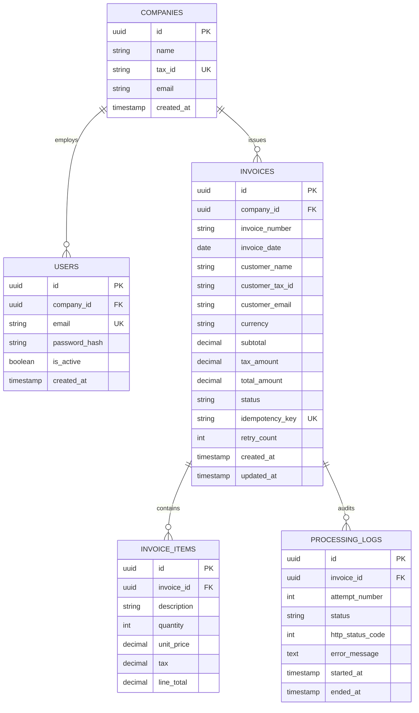

# Tubo — Electronic Invoicing & Government Compliance Platform

An enterprise-grade full-stack electronic invoicing platform that validates, stores, and asynchronously submits invoices to external government tax authorities (e.g. BIR e-Invoicing, MyInvois) with **zero data loss**, **idempotency**, **concurrency protection**, and **append-only audit trails**.

---

## 🚀 Quick Start (One-Command Setup)

### Prerequisites
- Docker Engine 20.10+ and Docker Compose v2+

### Run All Services
```bash
# Clone the repository and navigate into the root directory
cd tubo-full-stack-developer-assessment

# Start PostgreSQL, Redis, Django Backend, Celery Worker, and React Frontend
docker compose up --build
```

### Access URLs
| Service | URL | Description |
|---|---|---|
| **Frontend Dashboard** | [http://localhost:5173](http://localhost:5173) | React (Vite) + Tailwind CSS Dashboard |
| **Backend REST API** | [http://localhost:8000/api/](http://localhost:8000/api/) | Django REST Framework API |
| **Django Admin** | [http://localhost:8000/admin/](http://localhost:8000/admin/) | Database Administration Portal |
| **Mock Government API**| [http://localhost:8000/mock-gov/invoices/](http://localhost:8000/mock-gov/invoices/) | Simulated Tax Authority Endpoint |

### Seeded Demo Credentials
You can immediately sign in using the seeded demo account or click **"⚡ Use Seeded Demo Account"** on the login page:
- **Email:** `maria@abchardware.ph`
- **Password:** `Password123!`
- **Company:** ABC Hardware Store (TIN: `123-456-789`)

---

## 🏛️ System Architecture

```
┌────────────────────────────────────────────────────────────────────────┐
│                          React Frontend (SPA)                          │
│          Dashboard  •  Create Invoice Form  •  Audit Timeline          │
└───────────────────────────────────┬────────────────────────────────────┘
                                    │ HTTP / JWT Bearer
                                    ▼
┌────────────────────────────────────────────────────────────────────────┐
│                       Django REST Framework API                        │
│   • Request Validation & Server-Side Math Calculation                  │
│   • Multi-Tenant Company Scoping & JWT Authentication                  │
│   • Idempotency Key Computation: SHA256(Company + InvoiceNumber)       │
│   • Database Atomic Transactions & Unique Constraint Enforcement       │
└──────────────┬──────────────────────────────────────────┬──────────────┘
               │                                          │
        Enqueue Job                               Store Invoice (PENDING)
               │                                          │
               ▼                                          ▼
┌──────────────────────────────┐           ┌─────────────────────────────┐
│      Redis Message Broker    │           │    PostgreSQL 16 Database   │
│         (Queue Tier)         │           │    • companies, users       │
└──────────────┬───────────────┘           │    • invoices (unique UK)   │
               │                           │    • invoice_items          │
         Pulls Task                        │    • processing_logs        │
               │                           └──────────────▲──────────────┘
               ▼                                          │
┌──────────────────────────────┐                          │
│     Celery Worker Pool       │                          │
│  • SELECT FOR UPDATE Lock    │                          │
│  • Exponential Backoff       │──────────────────────────┘
│  • Idempotency Header        │         Append Audit Logs &
│  • Status Updates            │         Update Status (SUBMITTED/FAILED)
└──────────────┬───────────────┘
               │
          POST Payload + Idempotency-Key
               │
               ▼
┌────────────────────────────────────────────────────────────────────────┐
│                 External Government E-Invoicing Portal                 │
│      • 200 OK (Accepted)              • 503 (Temporary Outage)         │
│      • 400 Bad Request (Invalid TIN)  • 504 (Gateway Timeout)          │
│      • Idempotent Replay (Returns same result for repeated key)        │
└────────────────────────────────────────────────────────────────────────┘
```

---

## 📋 Database Schema & Relational Design



---

## 📚 Technical Reasoning & Architectural Q&A

### PART C — Database Design & Integrity

#### Question C1: Explain why you designed the database this way.
1. **Multi-Tenancy Isolation:** Separated `companies` and `users`. Multiple employees can belong to a single company, while all invoices and audit logs are strictly scoped to the parent `company_id`.
2. **Deterministic Idempotency:** The `invoices` table stores a unique `idempotency_key` (SHA-256 hash of `company_id + invoice_number`) that prevents duplicate submission at both the database and external API layers.
3. **Append-Only Audit Trail:** Rather than overwriting errors in the `invoices` table, every single government submission attempt writes a separate row into `processing_logs` recording exact timestamps, attempt numbers, HTTP response codes, and error bodies.
4. **Data Integrity:** Line totals, subtotals, and taxes use `DecimalField(max_digits=14, decimal_places=2)` to prevent floating-point rounding inaccuracies in financial accounting.

#### Question C2: How will your database prevent the same company from accidentally creating the same invoice twice?
Enforced by a PostgreSQL composite unique constraint:
```python
class Meta:
    constraints = [
        models.UniqueConstraint(
            fields=['company', 'invoice_number'],
            name='unique_company_invoice_number'
        )
    ]
```
Even if application validation were bypassed, PostgreSQL immediately raises an integrity violation error, caught by Django and returned as an `HTTP 409 Conflict`.

#### Question C3: Assume two identical requests arrive at exactly the same time (Company: ABC, Invoice: INV-10001). How will you guarantee that only one invoice is created?
1. Both requests enter atomic transactions (`transaction.atomic()`).
2. PostgreSQL’s MVCC (Multi-Version Concurrency Control) and unique index lock evaluate the constraint at commit time.
3. The first INSERT succeeds and commits.
4. The second INSERT encounters a **Unique Index Violation** on `(company_id, invoice_number)`.
5. The second transaction is rolled back and the API returns a structured `409 Conflict` without creating duplicate records or corrupting line items.

---

### PART E — Authentication & Security

#### Question E1: How do you guarantee User A cannot access Company B's invoices by modifying an ID in the URL?
Every invoice query is **strictly scoped to `request.user.company`** at the ORM layer:
```python
invoice = get_object_or_404(Invoice, id=id, company=request.user.company)
```
If User A requests an invoice ID belonging to Company B:
- The query returns `None`.
- The endpoint responds with `404 Not Found` (rather than `403 Forbidden`).
- **Security Benefit:** Returning `404` prevents enumeration attacks by giving an attacker zero confirmation whether the requested invoice ID even exists.

#### Question E2: Secret Storage & Git Hygiene
- **Storage:** Database credentials, `SECRET_KEY`, JWT signing keys, and external API keys are loaded via environment variables (`decouple.config` / Docker secrets / HashiCorp Vault).
- **Git Hygiene:** `.env` and sensitive files are explicitly excluded in `.gitignore`. Only `.env.example` with sanitized placeholder keys is committed to version control.

#### Question E3: Security checks implemented before accepting an invoice request
1. **JWT Authentication & Signature Verification** (rejecting expired or tampered tokens).
2. **Company Association Verification** (ensuring active, verified company profile).
3. **Strict Payload Schema Validation** (Zod & DRF Serializers validating field types, email formats, and string lengths).
4. **Server-Side Financial Recalculation** (rejecting client-tampered totals; line total, subtotal, and tax are calculated on the server).
5. **Idempotency & Duplicate Check** (verifying invoice number uniqueness before DB insertion).

---

### PART H & I — Asynchronous Processing & Critical Failure Recovery

#### Question H1: Asynchronous Architecture
1. Client POSTs invoice to `/api/invoices/`.
2. API validates, writes to PostgreSQL with `status = PENDING`, and returns `202 Accepted` within ~50ms.
3. API dispatches job to Redis queue.
4. Celery worker consumes task, locks the row (`SELECT FOR UPDATE`), sends payload to Government API, and updates status to `SUBMITTED` or schedules retries.

#### Question H2: Difference between Accepting vs Successfully Submitting
- **Acceptance (`202 Accepted`):** Tubo has validated the business format, secured the record in the database, and assumed responsibility for delivery.
- **Successful Submission (`SUBMITTED` / `200 OK`):** The external government tax authority has verified the customer TIN, recorded the invoice in the national tax registry, and issued an official reference clearance number.

#### Question H3: 30-Minute Government API Outage Retry Strategy
- Worker uses **Exponential Backoff with Jitter**:
  $$\text{Delay} = \text{Base} \times 2^{\text{attempt}} + \text{jitter}$$
- Attempt intervals: 1 min → 2 min → 4 min → 8 min → 16 min (total span > 31 minutes).
- If still unreachable after 5 attempts, invoice transitions to `FAILED`.
- System alerts operations, and the user can trigger one-click manual retry via `POST /api/invoices/<id>/retry/` once government service restores.

#### Part I: Critical Failure Scenario (Server crashes after Gov API accepts but before Tubo updates DB)
1. **What happens next (I1):** When the worker restarts, it sees the unacknowledged job and re-fetches the invoice.
2. **Preventing Duplicates (I2):** The worker re-submits with the exact same header:
   `Idempotency-Key: SHA256(CompanyID + InvoiceNumber)`
3. **Idempotency (I3):** The Government API recognizes the key from its idempotency cache, does **not** create a second invoice, and replays the original `200 OK Accepted` response. Tubo updates its database to `SUBMITTED`.

---

### PART J — Concurrency Bug Analysis

```python
# Unsafe Pseudocode from Assessment
const existingInvoice = await Invoice.findOne({ companyId, invoiceNumber });
if (!existingInvoice) {
    await Invoice.create({ companyId, invoiceNumber, total });
}
```

1. **Is it safe?** No.
2. **What could happen?** A classic **Time-of-Check to Time-of-Use (TOCTOU)** race condition. Two duplicate invoices can be created.
3. **Why both pass?** Both requests execute `findOne` concurrently before either has executed `create`. Both receive `null` and proceed to create.
4. **Fix:** 
   - Add a database unique constraint: `UNIQUE(company_id, invoice_number)`.
   - In Django: Wrap in `transaction.atomic()` and catch `IntegrityError` or use `get_or_create()` / `select_for_update()`.
5. **Is application-level validation alone sufficient?** No. Without database-level locking or unique constraints, multi-threaded or distributed instances cannot guarantee atomicity.

---

### PART K — Scaling to 1,000,000 Invoices/Day

```
                    ┌─────────────────────────┐
                    │    AWS ALB / NGINX      │
                    └────────────┬────────────┘
                                 │ Round-Robin / Least Conn
                 ┌───────────────┴───────────────┐
                 ▼                               ▼
       ┌──────────────────┐            ┌──────────────────┐
       │ API Instance #1  │            │ API Instance #N  │
       └────────┬─────────┘            └────────┬─────────┘
                │                               │
                └───────────────┬───────────────┘
                                ▼
                   ┌─────────────────────────┐
                   │    Redis Cluster 7      │ (Queue & Rate Limiter)
                   └────────────┬────────────┘
                                │ Distributed Task Draining
                 ┌──────────────┴───────────────┐
                 ▼                               ▼
       ┌──────────────────┐            ┌──────────────────┐
       │ Celery Worker #1 │            │ Celery Worker #M │
       │ (Rate-Limited)   │            │ (Rate-Limited)   │
       └────────┬─────────┘            └────────┬─────────┘
                │                               │
                ▼                               ▼
       ┌──────────────────┐            ┌──────────────────┐
       │ PostgreSQL Primary│◄───────────│ PgBouncer Pooler │
       │ (Writes)         │            └──────────────────┘
       └────────┬─────────┘
                │ Replication
                ▼
       ┌──────────────────┐
       │ Read Replicas    │ (Dashboard GET queries)
       └──────────────────┘
```

#### Question K1: Architectural Evolution
- **Throughput Requirement:** $1,000,000 \text{ invoices/day} \approx 12 \text{ invoices/sec average}, 150\text{–}300 \text{ peak/sec}$.
- **API Tier:** Stateless Docker containers behind an Application Load Balancer with Horizontal Pod Autoscaling (HPA).
- **Database:** PostgreSQL with **PgBouncer** connection pooling, Write-Master with Read-Replicas for dashboard queries, and table partitioning by `invoice_date` (e.g. monthly partitions).
- **Storage:** Invoice PDFs / raw XML payloads offloaded to AWS S3 / Cloudflare R2 object storage.

#### Question K2 & K3: Handling 100,000 Invoices in 10 minutes vs 100 req/sec Government Rate Limit
- **Strategy:** Decouple ingestion from submission.
- **Ingestion:** API accepts 100,000 invoices in 10 minutes (~166/sec) directly into PostgreSQL & Redis queue.
- **Submission:** Workers drain Redis using a **Token Bucket Rate Limiter**:
  ```python
  # Celery rate limit configuration
  @shared_task(rate_limit='100/s')
  def submit_invoice_to_government_task(...):
      ...
  ```
- **Simultaneous Processing:** **No.** Queue acts as a buffer. Invoices drain at steady 95 req/sec (leaving 5% safety margin), processing the entire 100,000 burst in ~17.5 minutes without dropping requests or triggering HTTP 429 penalties.

---

### PART L — Failure & Audit Trail Design

#### Question L1: Would you overwrite the previous error every time?
**No.** Overwriting destroys the audit trail. In financial compliance, you must prove when attempts were made, whether network timeouts occurred, and what error payload was returned. Every attempt appends a new `ProcessingLog` record.

#### Question L2: How a support engineer investigates why an invoice failed 3 days ago
Query the audit log directly or view the UI timeline:
```sql
SELECT 
    pl.attempt_number,
    pl.started_at,
    pl.ended_at,
    pl.http_status_code,
    pl.error_message,
    pl.status
FROM processing_processinglog pl
JOIN invoices_invoice i ON pl.invoice_id = i.id
WHERE i.invoice_number = 'INV-20001'
ORDER BY pl.attempt_number ASC;
```

---

### PART M — API Versioning Strategy

To introduce breaking schema changes without disrupting existing V1 integrations:
1. **URI Versioning:** Keep `/api/v1/invoices/` active while introducing `/api/v2/invoices/`.
2. **Adapter Pattern:** V1 and V2 controllers translate payloads into a shared internal domain model.
3. **Deprecation Headers:**
   ```http
   Deprecation: @1798761600
   Sunset: Wed, 31 Dec 2026 23:59:59 GMT
   Link: <https://api.tubo.ph/docs/v2>; rel="successor-version"
   ```
4. **Grace Period:** Provide 6–12 months transition window before returning `410 Gone` on deprecated versions.

---

### PART N — Debugging Production Bottlenecks

**Given:** CPU 35%, Memory 55%, DB CPU 20%, API normal, External API normal, **Queue Backlog: 150,000**, **Workers: 5**.

1. **Where to investigate first:** Worker throughput and concurrency configuration (`celery inspect active`, job latency, network I/O wait times).
2. **What metrics suggest:** The system is I/O-blocked on external HTTP calls. With only 5 workers waiting ~200ms per HTTP call, total throughput is capped at only $\approx 25 \text{ jobs/sec}$.
3. **Additional metrics to check:** Average job duration, Celery concurrency (`-c` threads/processes), event loop latency, and Redis queue drain rate.
4. **Changes to improve throughput:**
   - Scale workers from 5 to 50–100 worker processes or use gevent/asyncio greenlets for I/O pooling.
   - Batch submissions if the Government API supports bulk endpoints (`/invoices/batch`).
5. **Preventing downstream overload:** Implement distributed Redis-based rate limiting to prevent scaled workers from exceeding database connection pool limits or the Government API's 100 req/sec ceiling.

---

## 🛠️ Postman Collection

Import `postman_collection.json` located in the root directory into Postman. It includes pre-configured requests for:
- User Registration & JWT Authentication
- Invoice Creation, Listing (with filters & search), and Statistics
- Invoice Detail with Audit Trail
- Manual Retry of Failed Invoices
- Direct Testing of Mock Government API with Idempotency

---

## 🔮 Production Improvements Roadmap

If preparing for live multi-region enterprise production:
1. **Refresh Token Rotation & Revocation:** Implement Redis token blacklist for instant user de-authorization.
2. **Dead Letter Queue (DLQ):** Route permanently failing invoices to a dedicated DLQ with PagerDuty integration.
3. **OpenTelemetry & Distributed Tracing:** Instrument end-to-end request tracing across Frontend → API → Redis → Worker → Government Portal.
4. **Digital Signatures & PDF/XML Generation:** Generate signed PDF invoices with QR codes for physical tax audits.
5. **Database Partitioning:** Range-partition `invoices` and `processing_logs` by month/year for query speed on tables exceeding 50M rows.
